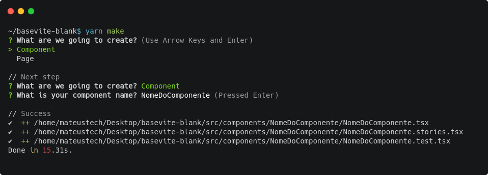

# Boilerplate for Front-end

## Stack:

- Typescript
- Vite ( bundler )
- Tailwind 3 ( css )
- Jest ( tests )
- Graphql ( api )
- Storybook ( component docs )

### Make sure to install recommended vscode extensions

Check .vscode/extensions.json for more details

## NPM commands

```
npm install

# start development
npm run start

# build project
npm run build # build

# serve project build
npm run serve

# show TS and lint errors
npm run lint

# run tests
npm run test

# make Component or Page
npm run make 
```
#### CLI-MAKE (Components and Pages)
CLI for create Components and/or Pages based in template pre-defined.



# Build and .env

Vite can automatically load .env files depending on the build params, please read the documentation carefully.

https://vitejs.dev/guide/env-and-mode.html

# Basic folder structure

<b>/public</b> : Used for static asset serving, eg: robots.txt , https://vitejs.dev/guide/assets.html#the-public-directory

<b>src/\_\_generatedTypes\_\_</b> : Automatically generated graphql types from apollo

<b>src/assets</b> : Images and Static files ( json, xml )

<b>src/components</b> : Re-usable React components

<b>src/icons</b> : Project icons such as responsibe SVGs

<b>src/pages</b> : Project Route pages components

<b>src/template</b> : Template React Components such as Footer, Header, Menu, etc